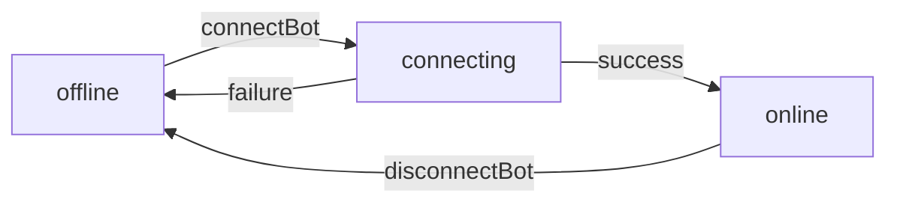

## Method Signature

```typescript
connectBot(botId: string): Promise<{ success: boolean }>
```

Connects a bot to WhatsApp, changing its status to "online". This method should be called after the bot has been authenticated via QR code scan.

## Parameters

<ParamField path="botId" type="string" required>
  The unique identifier of the bot to connect. This is the GestorPro bot ID, not the BuilderBot ID.
</ParamField>

## Returns

<ResponseField name="Promise<{ success: boolean }>" type="Promise">
  Returns a promise that resolves to an object with a success flag
  
  <Expandable title="Response Object">
    <ResponseField name="success" type="boolean" required>
      `true` if the bot was successfully connected, `false` otherwise
    </ResponseField>
  </Expandable>
</ResponseField>

## Code Examples

<CodeGroup>
```typescript Basic Usage
import { connectBot } from './services/api';

async function bringBotOnline(botId: string) {
  try {
    const result = await connectBot(botId);
    
    if (result.success) {
      console.log('Bot is now online and ready to receive messages');
    } else {
      console.error('Failed to connect bot');
    }
    
    return result.success;
  } catch (error) {
    console.error('Error connecting bot:', error);
    throw error;
  }
}
```

```typescript With Status Verification
import { connectBot, getBots } from './services/api';

async function connectAndVerify(botId: string) {
  // Connect the bot
  const result = await connectBot(botId);
  
  if (!result.success) {
    throw new Error('Failed to connect bot');
  }
  
  // Verify status changed
  const bots = await getBots();
  const bot = bots.find(b => b.id === botId);
  
  if (bot?.status === 'online') {
    console.log(`Bot "${bot.name}" is now online`);
    console.log(`Online since: ${bot.onlineSince}`);
    return true;
  } else {
    console.warn(`Bot status is "${bot?.status}", expected "online"`);
    return false;
  }
}
```

```typescript React Component
import { useState } from 'react';
import { connectBot, disconnectBot } from './services/api';
import type { Bot } from './types';

function BotConnectionToggle({ bot }: { bot: Bot }) {
  const [loading, setLoading] = useState(false);
  const [error, setError] = useState<string | null>(null);

  const handleToggle = async () => {
    setLoading(true);
    setError(null);

    try {
      if (bot.status === 'online') {
        const result = await disconnectBot(bot.id);
        if (result.success) {
          console.log('Bot disconnected');
        }
      } else {
        const result = await connectBot(bot.id);
        if (result.success) {
          console.log('Bot connected');
        }
      }
    } catch (err) {
      setError(err instanceof Error ? err.message : 'Connection failed');
    } finally {
      setLoading(false);
    }
  };

  return (
    <div>
      <button onClick={handleToggle} disabled={loading}>
        {loading ? 'Processing...' : bot.status === 'online' ? 'Disconnect' : 'Connect'}
      </button>
      {error && <div className="error">{error}</div>}
      <span>Status: {bot.status}</span>
    </div>
  );
}
```

```typescript Complete Setup Flow
import { addBot, getBotQrCode, connectBot } from './services/api';

async function setupAndConnectBot() {
  // Step 1: Create the bot
  const bot = await addBot({
    name: "My Support Bot",
    description: "Customer support assistant",
    systemInstruction: "You are a helpful support assistant.",
    id_builderBot: "bb_123456"
  });
  
  console.log('Bot created:', bot.id);
  
  // Step 2: Get QR code
  const { qr } = await getBotQrCode(bot.id_builderBot);
  console.log('QR code retrieved');
  
  // Step 3: Display QR code to user
  displayQrCodeInUI(qr);
  
  // Step 4: Wait for user to scan QR code
  await waitForQrScan(); // Your custom implementation
  
  // Step 5: Connect the bot
  const result = await connectBot(bot.id);
  
  if (result.success) {
    console.log('Bot is now online and ready!');
    return bot;
  } else {
    throw new Error('Failed to connect bot after QR scan');
  }
}
```

```typescript Polling for Connection
import { connectBot, getBots } from './services/api';

async function connectBotWithPolling(botId: string, maxAttempts = 10) {
  const result = await connectBot(botId);
  
  if (!result.success) {
    throw new Error('Initial connection request failed');
  }
  
  // Poll for status change
  for (let i = 0; i < maxAttempts; i++) {
    await new Promise(resolve => setTimeout(resolve, 2000)); // Wait 2 seconds
    
    const bots = await getBots();
    const bot = bots.find(b => b.id === botId);
    
    if (bot?.status === 'online') {
      console.log(`Bot online after ${i + 1} attempts`);
      return bot;
    }
    
    console.log(`Attempt ${i + 1}/${maxAttempts}: Status is ${bot?.status}`);
  }
  
  throw new Error('Bot did not come online within expected time');
}
```
</CodeGroup>

## Response Example

```json
{
  "success": true
}
```

## Workflow Integration

The typical bot connection workflow:

<Steps>
  <Step title="Create Bot">
    Call `addBot()` to create a new bot instance (status: "offline")
  </Step>
  <Step title="Get QR Code">
    Call `getBotQrCode(bot.id_builderBot)` to generate WhatsApp QR code
  </Step>
  <Step title="Display QR Code">
    Show QR code to user for WhatsApp scanning
  </Step>
  <Step title="Wait for Scan">
    User scans QR code with their WhatsApp app
  </Step>
  <Step title="Connect Bot">
    Call `connectBot(bot.id)` to bring the bot online
  </Step>
  <Step title="Verify Status">
    Poll `getBots()` to confirm status changed to "online"
  </Step>
</Steps>

```typescript
// Complete workflow implementation
async function completeConnectionWorkflow(builderBotId: string) {
  // 1. Create bot
  const bot = await addBot({
    name: "New Bot",
    description: "A new bot",
    systemInstruction: "You are a helpful assistant.",
    id_builderBot: builderBotId
  });
  
  // 2. Get QR code
  const { qr } = await getBotQrCode(builderBotId);
  
  // 3. Show QR to user (your UI implementation)
  showQrCodeModal(qr);
  
  // 4. Wait for QR scan confirmation from user
  await waitForUserConfirmation("Have you scanned the QR code?");
  
  // 5. Connect the bot
  const result = await connectBot(bot.id);
  
  if (!result.success) {
    throw new Error('Connection failed');
  }
  
  // 6. Verify online status
  let attempts = 0;
  while (attempts < 5) {
    const bots = await getBots();
    const updatedBot = bots.find(b => b.id === bot.id);
    
    if (updatedBot?.status === 'online') {
      console.log('Bot successfully connected!');
      return updatedBot;
    }
    
    await new Promise(r => setTimeout(r, 2000));
    attempts++;
  }
  
  throw new Error('Bot did not come online');
}
```

## Error Handling

<CodeGroup>
```typescript Basic Error Handling
import { connectBot } from './services/api';

async function safeConnectBot(botId: string) {
  try {
    const result = await connectBot(botId);
    
    if (!result.success) {
      throw new Error('Connection request was unsuccessful');
    }
    
    return true;
  } catch (error) {
    if (error instanceof Error) {
      if (error.message.includes('not authenticated')) {
        console.error('User session expired');
        // Redirect to login
      } else if (error.message.includes('not found')) {
        console.error('Bot does not exist');
      } else {
        console.error('Connection error:', error.message);
      }
    }
    return false;
  }
}
```

```typescript With Retry Logic
import { connectBot } from './services/api';

async function connectBotWithRetry(botId: string, maxRetries = 3) {
  for (let attempt = 1; attempt <= maxRetries; attempt++) {
    try {
      const result = await connectBot(botId);
      
      if (result.success) {
        console.log(`Connected successfully on attempt ${attempt}`);
        return true;
      }
      
      console.log(`Attempt ${attempt} failed, retrying...`);
    } catch (error) {
      console.error(`Attempt ${attempt} error:`, error);
      
      if (attempt === maxRetries) {
        throw new Error(`Failed to connect after ${maxRetries} attempts`);
      }
    }
    
    // Wait before retrying (exponential backoff)
    await new Promise(r => setTimeout(r, 1000 * attempt));
  }
  
  return false;
}
```
</CodeGroup>

## Important Notes

<Warning>
Always ensure the bot has been authenticated with WhatsApp (via QR code scan) before calling `connectBot()`. Attempting to connect an unauthenticated bot will fail.
</Warning>

<Note>
The `connectBot()` method may return `success: true` immediately, but the bot's status might take a few seconds to update to "online". Implement polling or refresh mechanisms to verify the final status.
</Note>

<Warning>
Do not call `connectBot()` repeatedly in rapid succession. If connection fails, wait a few seconds before retrying, or investigate the underlying issue.
</Warning>

## Status Transitions



Expected status flow:
1. New bots start as `"offline"`
2. Calling `connectBot()` may briefly set status to `"connecting"`
3. Successful connection results in status `"online"`
4. Failed connection reverts to `"offline"`

## Best Practices

1. **Always check current status** before calling `connectBot()`
2. **Implement loading states** in UI during connection
3. **Poll for status updates** after connection request
4. **Handle all error cases** gracefully with user feedback
5. **Log connection attempts** for debugging and audit trails
6. **Set reasonable timeouts** - don't wait indefinitely for status change

## See Also

- [disconnectBot](/api/bots/disconnect-bot) - Disconnect a bot from WhatsApp
- [getBotQrCode](/api/bots/get-qr-code) - Get QR code for WhatsApp authentication
- [getBots](/api/bots/get-bots) - Check bot status after connection
- [addBot](/api/bots/add-bot) - Create a new bot before connecting
